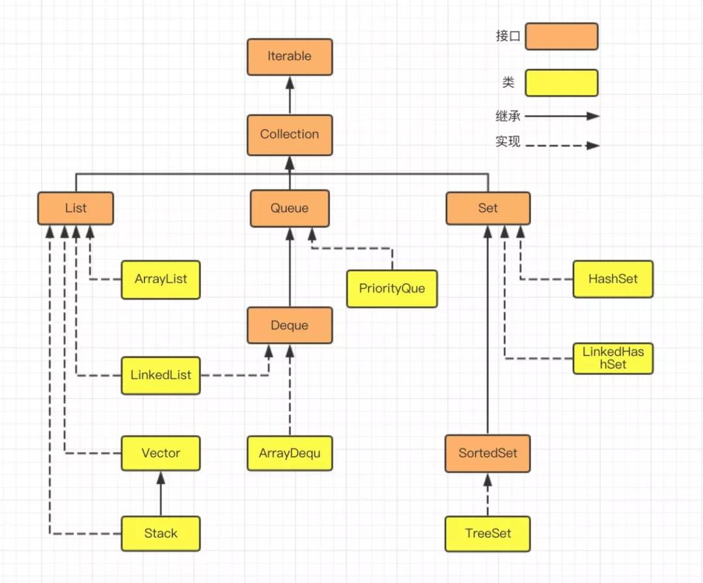

## 3. 栈和队列

### 3.1 Java 中的栈和队列

Java 集合接口和类关系图：



1. 要使用栈时，不推荐使用 `Stack`，推荐使用 `Deque` 接口，实现采用 `LinkedList` 或者 `ArrayQueue` 类
2. 要使用队列时，推荐使用 `Queue` / `Deque` 接口，实现采用 `LinkedList` / `ArrayQueue` 类
3. `ArrayQueue` 是一个基于动态数组实现的双端队列，可以想象，在队列中存在两个指针，一个指向头部，一个指向尾部，因此它具有“FIFO队列”及“栈”的方法特性。
4. `LinkedList` 是 `List` 接口的实现类，也是 `Deque` 的实现类，底层是一种双向链表的数据结构，在上面咱们也有所介绍，LinkedList可以根据索引来获取元素，增加或删除元素的效率较高，如果查找的话需要遍历整合集合，效率较低

```java
public class JavaStackTest {
    @Test
    void test() {
        // 队列：Queue 接口，ArrayDeque 实现
        Queue<Integer> queue1 = new ArrayDeque<>(List.of(1,2,3));
        queue1.offer(5);
        queue1.add(4);
        queue1.poll();
        queue1.remove();
        queue1.peek();
        queue1.element();
        System.out.println(queue1);

        // 队列：Queue 接口，LinkedList 实现
        Queue<Integer> queue2 = new LinkedList<>(List.of(1,2,3));
        queue2.offer(5);
        queue2.add(4);
        queue2.poll();
        queue2.remove();
        queue2.peek();
        queue2.element();

        // 栈：Deque 接口，ArrayDeque 实现
        Deque<Number> stack1 = new ArrayDeque<>();
        stack1.push(1);
        stack1.pop();
        stack1.peek();
        stack1.size();
        stack1.isEmpty();

        // 栈：Deque 接口，LinkedList 实现
        Deque<Number> stack2 = new LinkedList<>();
        stack2.push(1);
        stack2.pop();
        stack2.peek();
        stack2.size();
        stack2.isEmpty();
    }
}
```

| 方法名称 | 含义 | 返回值 | 异常情况 |
|---|---|---|---|
| `offer(e)` | 将指定的元素插入到队列中（如果可以立即执行而不违反容量限制）。 | 成功时返回 `true`，如果队列已满则返回 `false`。 | 不抛出异常。 |
| `add(e)` | 将指定的元素插入到队列中（如果可以立即执行而不违反容量限制）。 | 成功时返回 `true`。 | 如果队列已满，则抛出 `IllegalStateException`。 |
| `poll()` | 检索并移除队列的头部。 | 返回队列的头部；如果队列为空，则返回 `null`。 | 不抛出异常。 |
| `remove()` | 检索并移除队列的头部。 | 返回队列的头部。 | 如果队列为空，则抛出 `NoSuchElementException`。 |
| `peek()` | 检索但不移除队列的头部。 | 返回队列的头部；如果队列为空，则返回 `null`。 | 不抛出异常。 |
| `element()` | 检索但不移除队列的头部。 | 返回队列的头部。 | 如果队列为空，则抛出 `NoSuchElementException`。 |

### 为什么不推荐使用 Stack？

1. **`Stack` 继承自 `Vector`，违反了设计原则**
    - `Stack` 是 `Vector` 的子类，而 `Vector` 是一个线程安全的动态数组。
    - 继承 `Vector` 导致 `Stack` 继承了 `Vector` 的所有方法（如 `add`, `remove`, `get` 等），但这些方法并不是栈操作（如 `push`, `pop`, `peek`）的一部分。
    - 这种设计违反了面向对象设计的“单一职责原则”和“接口隔离原则”，因为 `Stack` 暴露了不必要的方法，增加了误用的风险。

2. **`Vector` 的性能问题**
    - `Vector` 是线程安全的，它的方法都加了 `synchronized` 关键字，这会导致性能开销。
    - 如果不需要线程安全的环境，使用 `Stack` 会带来不必要的性能损失。
    - 如果需要线程安全，可以使用 `Collections.synchronizedDeque` 包装一个 `Deque` 实现类（如 `ArrayDeque`）。
      ```java
      Deque<Integer> stack = Collections.synchronizedDeque(new ArrayDeque<>());
      stack.push(1);
      stack.push(2);
      int top = stack.pop(); // 2
      ```

### 参考

- https://developer.aliyun.com/article/866814