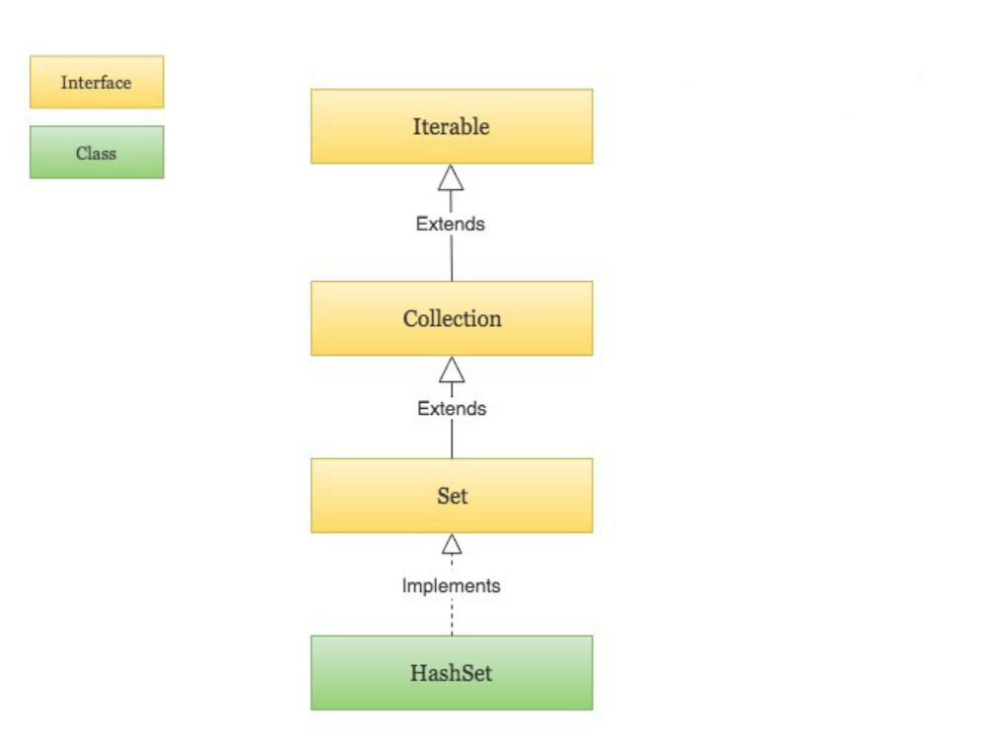

## Hash Map

哈希表（hash table），又称散列表，它通过建立键 key 与值 value 之间的映射，实现高效的元素查询。

### HashMap 自定义实现

哈希表就是一组键值对（`key-value`）的集合，通常可以用数组/列表实现。定义一个桶容器数组 `buckets`，然后将 `key` 通过哈希函数（`hashFunc(key)`）计算得到 `index`，根据索引 `index` 来获取或者设置桶数组 `buckets` 中的元素。

- `key`：哈希表中的 “键”
- `value`：哈希表中的 “值”
- `buckets`：底层实现，又叫桶数组，类型通常是 `List<Pair<K, V>>`，储存键值对（以便方便获取键、值、键值对）
- `hashFunc`：哈希函数，计算哈希值，从而获取在桶数组中中的索引
- `hash`：哈希值，又叫散列，由哈希函数计算而来
- `index`：元素在桶数组中的索引值，即哈希值
- 哈希冲突：不同 `key` 通过哈希函数计算出来的结果相同，不可能一个索引放两个数组，称为哈希冲突。哈希冲突可以通过 “开链法”，“线性碰撞法” 等方法解决。

基于列表实现 Hash Map：
[ArrayListHashMap](../core/hashmap/ArrayListHashMap.java)

### java Map API


#### Java 遍历 Map 四种方法

```java
public static void main(String[] args) {
    Map<String, String> map = new HashMap<String, String>();
    map.put("1", "value1");
    map.put("2", "value2");
    map.put("3", "value3");
  
    //第一种：普遍使用，二次取值
    System.out.println("通过Map.keySet遍历key和value：");
    for (String key : map.keySet()) {
        System.out.println("key= "+ key + " and value= " + map.get(key));
    }
  
    //第二种
    System.out.println("通过Map.entrySet使用iterator遍历key和value：");
    Iterator<Map.Entry<String, String>> it = map.entrySet().iterator();
    while (it.hasNext()) {
        Map.Entry<String, String> entry = it.next();
        System.out.println("key= " + entry.getKey() + " and value= " + entry.getValue());
    }
  
    //第三种：推荐，尤其是容量大时
    System.out.println("通过Map.entrySet遍历key和value");
    for (Map.Entry<String, String> entry : map.entrySet()) {
        System.out.println("key= " + entry.getKey() + " and value= " + entry.getValue());
    }
 
    //第四种
    System.out.println("通过Map.values()遍历所有的value，但不能遍历key");
    for (String v : map.values()) {
        System.out.println("value= " + v);
    }
}
```

#### Java TreeMap

TreeMap 会根据键的自然顺序（LocalDate 实现了 Comparable 接口）自动排序。

```java
@Test
void testTreeMap() {
    TreeMap<Integer, LocalDate> treeMap = new TreeMap<>();
    DateTimeFormatter format = DateTimeFormatter.ofPattern("yyyy-MM-dd");
    treeMap.put(4, LocalDate.parse("2024-01-04", format));
    treeMap.put(1, LocalDate.parse("2024-01-01", format));
    treeMap.put(3, LocalDate.parse("2024-01-03", format));
    for (Map.Entry<Integer, LocalDate> entry: treeMap.entrySet()) {
        System.out.println(entry);
    }

    TreeMap<LocalDate, Integer> treeMap2 = new TreeMap<>();
    treeMap2.put(LocalDate.parse("2024-01-04", format), 4);
    treeMap2.put(LocalDate.parse("2024-01-01", format), 1);
    treeMap2.put(LocalDate.parse("2024-01-03", format), 3);
    for (Map.Entry<LocalDate, Integer> entry : treeMap2.entrySet()) {
        System.out.println(entry);
    }
}
```

#### Java HashMap vs HashTable

优先 HashMap (单线程) 和 ConcurrentHashMap (多线程)，Hashtable 基本上可以放进技术博物馆了，除非是搞“代码考古”。


| 特性              | HashMap                    | Hashtable                                             |
|:----------------|:---------------------------|:------------------------------------------------------|
| **线程安全性**       | ❌ 非线程安全                    | ✅ 线程安全 (使用 `synchronized`)                            |
| **Null 键/值**    | ✅ 允许一个 null 键，多个 null 值    | ❌ 不允许 null 键和 null 值                                  |
| **性能**          | ⚡️ 较高 (尤其单线程)              | 🐢 较低 (因同步开销)                                         |
| **继承体系**        | 继承自 `AbstractMap` (JCF 成员) | 继承自 `Dictionary` (遗留类)，也实现 `Map`                      |
| **迭代器**         | `Iterator` (fail-fast)     | `Iterator` (fail-fast), `Enumeration` (non-fail-fast) |
| **初始容量**        | 16                         | 11                                                    |
| **扩容机制**        | 容量变为原来的 2 倍                | 容量变为 `2 * oldCapacity + 1`                            |
| **底层优化(JDK8+)** | ✅ 链表过长时转为红黑树               | ❌ 始终是链表                                               |
| **推荐使用场景**      | 单线程环境，或外部同步控制，允许 null      | 遗留代码兼容，或极简单的线程安全需求 (但更推荐 ConcurrentHashMap)           |
| **现代推荐替代**      | (并发场景) `ConcurrentHashMap` | `ConcurrentHashMap`                                   |

#### HashSet

底层实现：HashSet 基于 HashMap 实现，元素作为键，固定的 PRESENT 对象作为值。
唯一性保证：依赖于 hashCode 和 equals 方法。
性能：平均时间复杂度为 O(1)，但受哈希冲突影响。
注意事项：
存储的对象必须正确重写 hashCode 和 equals 方法。
避免修改 HashSet 中元素的字段，以免导致哈希值变化。



### 参考阅读

- https://www.cnblogs.com/dxflqm/p/11867611.html
- https://blog.csdn.net/q5706503/article/details/85122343
- https://www.cnblogs.com/xinzhao/p/5644175.html