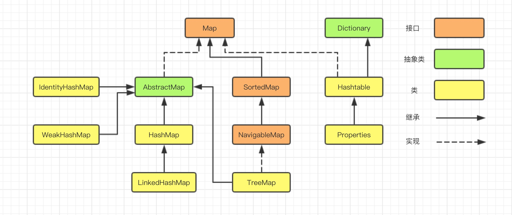

## Hash Map

哈希表（hash table），又称散列表，它通过建立键 key 与值 value 之间的映射，实现高效的元素查询。

### HashMap 自定义实现

哈希表就是一组键值对（`key-value`）的集合，通常可以用数组/列表实现。定义一个桶容器数组 `buckets`，然后将 `key` 通过哈希函数（`hashFunc(key)`）计算得到 `index`，根据索引 `index` 来获取或者设置桶数组 `buckets` 中的元素。

- `key`：哈希表中的 “键”
- `value`：哈希表中的 “值”
- `buckets`：底层实现，又叫桶数组，类型通常是 `List<Pair<K, V>>`，储存键值对（以便方便获取键、值、键值对）
- `hashFunc`：哈希函数，计算哈希值，从而获取在桶数组中中的索引
- `hash`：哈希值，又叫散列，由哈希函数计算而来
- `index`：元素在桶数组中的索引值，即哈希值
- 哈希冲突：不同 `key` 通过哈希函数计算出来的结果相同，不可能一个索引放两个数组，称为哈希冲突。哈希冲突可以通过 “开链法” 等方法解决。

基于列表实现 Hash Map：
[ArrayListHashMap](../core/hashmap/ArrayListHashMap.java)

### java Map API



#### Java 遍历 Map 四种方法

```java
public static void main(String[] args) {
    Map<String, String> map = new HashMap<String, String>();
    map.put("1", "value1");
    map.put("2", "value2");
    map.put("3", "value3");
  
    //第一种：普遍使用，二次取值
    System.out.println("通过Map.keySet遍历key和value：");
    for (String key : map.keySet()) {
        System.out.println("key= "+ key + " and value= " + map.get(key));
    }
  
    //第二种
    System.out.println("通过Map.entrySet使用iterator遍历key和value：");
    Iterator<Map.Entry<String, String>> it = map.entrySet().iterator();
    while (it.hasNext()) {
        Map.Entry<String, String> entry = it.next();
        System.out.println("key= " + entry.getKey() + " and value= " + entry.getValue());
    }
  
    //第三种：推荐，尤其是容量大时
    System.out.println("通过Map.entrySet遍历key和value");
    for (Map.Entry<String, String> entry : map.entrySet()) {
        System.out.println("key= " + entry.getKey() + " and value= " + entry.getValue());
    }
 
    //第四种
    System.out.println("通过Map.values()遍历所有的value，但不能遍历key");
    for (String v : map.values()) {
        System.out.println("value= " + v);
    }
}
```

### 参考阅读

- https://www.cnblogs.com/dxflqm/p/11867611.html
- https://blog.csdn.net/q5706503/article/details/85122343